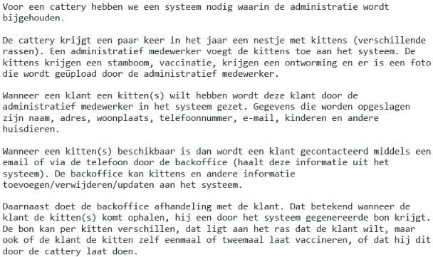
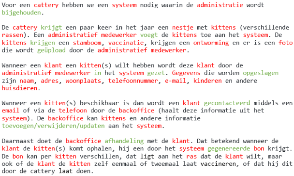
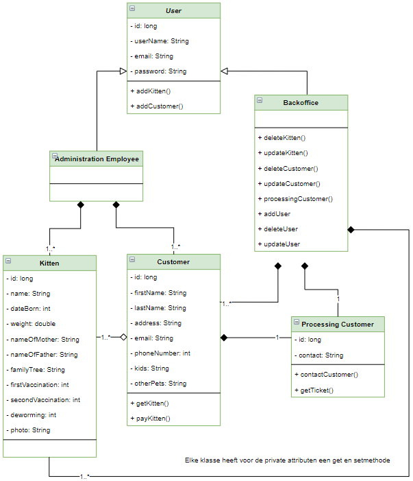
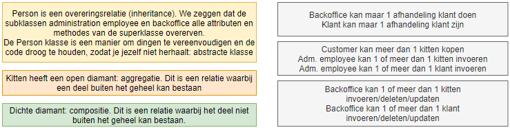
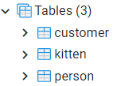
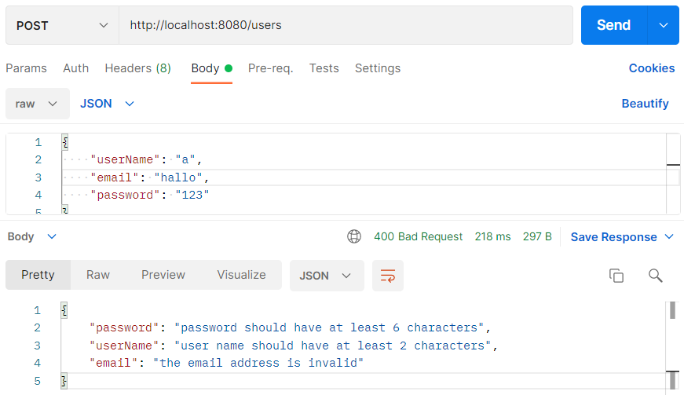
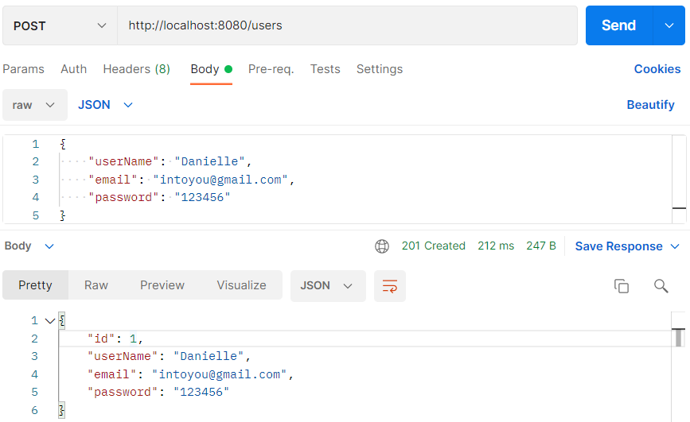
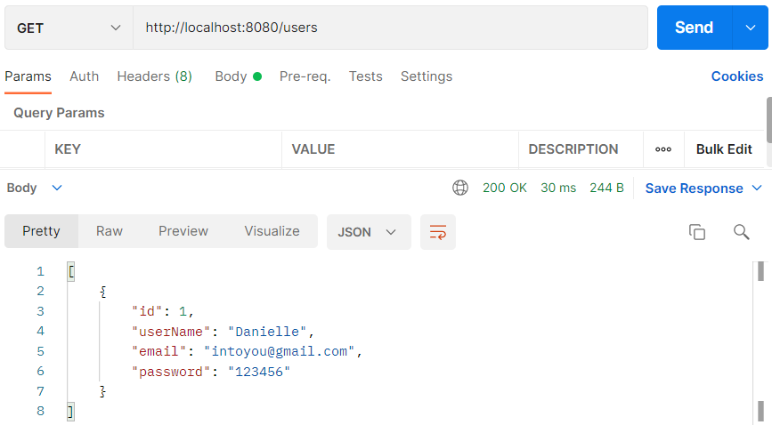
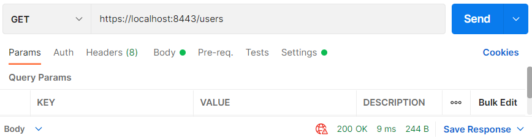

## Stap 1: Het idee



## Stap 2: ontwerp UML

### Eerste opzet 

De rode woorden zijn zelfstandige naamwoorden, de groene woorden zijn de werkwoorden.



De zelfstandige naamwoorden voor het idee zijn als volgt.

- Administratief medewerker
- Backoffice
- Kitten
- Klant

### Klassendiagram

_Concept klassendiagram_





## Software

### Stap 3: Initializr

Ga naar de website <a href="https://start.spring.io" target="_blank">spring.io</a>. De volgende gegevens vul je in voor
het eerste Spring Boot project.

- Project: vink aan `Maven Project`
- Language: vink aan `Java`
- Spring Boot: vink aan `2.5.6` (laatste versie)
- Project Metadata: vul informatie in over jouw project
    - Group: `nl.danielle` (identifier van de ontwikkelaar)
    - Artifact: `cattery` (hoe heet je project)
    - Name: `cattery` (hoe heet je project)
    - Description: `Cattery project for Spring Boot`
    - Package name: maakt het systeem zelf aan
    - Packaging: vink aan `Jar`
    - Java: vink aan `11`

Klik op "add dependencies" en voeg `Spring Web`, `SpringData JPA` en `PostgreSQL Driver` toe.

Met "generate" wordt er een bestand in jouw download map gezet. Unzip het bestand en open het in Intellij.

Klik vervolgens rechtsonder in IntelliJ op `Load`.

Ga naar File > Project Structure en zet `Project SDK` op 11. Klik op apply.

### Stap 4: pom.xml 

Wanneer je in `pom.xml` een foutmelding krijgt, zet je de `<parent>` versie op `<version>2.4.3</version>` en wanneer je een foutmelding in de `<plugin>` krijg zet je de versie er tussen op de volgende manier: `<version>${project.parent.version}</version>`.

De pom.xml heeft de volgende structuur:

```xml
<?xml version="1.0" encoding="UTF-8"?>
<project xmlns="http://maven.apache.org/POM/4.0.0" xmlns:xsi="http://www.w3.org/2001/XMLSchema-instance"
	xsi:schemaLocation="http://maven.apache.org/POM/4.0.0 https://maven.apache.org/xsd/maven-4.0.0.xsd">
	<modelVersion>4.0.0</modelVersion>
	<parent>
		<groupId>org.springframework.boot</groupId>
		<artifactId>spring-boot-starter-parent</artifactId>
		<version>2.4.3</version>
		<relativePath/> <!-- lookup parent from repository -->
	</parent>
	<groupId>nl.danielle</groupId>
	<artifactId>cattery</artifactId>
	<version>0.0.1-SNAPSHOT</version>
	<name>cattery</name>
	<description>Cattery project for Spring Boot</description>
	<properties>
		<java.version>11</java.version>
	</properties>
	<dependencies>
		<dependency>
			<groupId>org.springframework.boot</groupId>
			<artifactId>spring-boot-starter-data-jpa</artifactId>
		</dependency>
		<dependency>
			<groupId>org.springframework.boot</groupId>
			<artifactId>spring-boot-starter-web</artifactId>
		</dependency>

		<dependency>
			<groupId>org.postgresql</groupId>
			<artifactId>postgresql</artifactId>
			<scope>runtime</scope>
		</dependency>
		<dependency>
			<groupId>org.springframework.boot</groupId>
			<artifactId>spring-boot-starter-test</artifactId>
			<scope>test</scope>
		</dependency>
	</dependencies>

	<build>
		<plugins>
			<plugin>
				<groupId>org.springframework.boot</groupId>
				<artifactId>spring-boot-maven-plugin</artifactId>
				<version>${project.parent.version}</version>
			</plugin>
		</plugins>
	</build>

</project>
```
### Stap 5: application.properties

`@SpringBootApplication` moet gaan communiceren met postgreSQL. Om dit voorelkaar te krijgen moet je in het project van IntelliJ naar `resources` gaan en dan `application.properties`. De gegevens van postgreSQL worden aan de hand van de code die je daar inzet gekoppeld met de database.

    # datasource PostgreSQl
    spring.datasource.platform=postgres
    spring.datasource.url=jdbc:postgresql://localhost:5432/cattery
    spring.datasource.username=postgres
    spring.datasource.password=postgres123
    spring.datasource.driver-class-name=org.postgresql.Driver
    
    # jpa
    spring.jpa.database=postgresql
    spring.jpa.show-sql=true
    
    # generate schema dll to create tables
    spring.jpa.generate-ddl=true
    spring.jpa.hibernate.ddl-auto=create
    spring.datasource.initialization-mode=always
    
    # database initialization with data.sql after hibernate
    spring.jpa.defer-datasource-initialization=true
    
    # hibernate
    spring.jpa.properties.hibernate.dialect=org.hibernate.dialect.PostgreSQLDialect
    
    # Fix Postgres JPA Error (Method org.postgresql.jdbc.PgConnection.createClob() is not yet implemented).
    spring.jpa.properties.hibernate.jdbc.lob.non_contextual_creation=true

- `url` is de database naam in pgAdmin
- `username` is jouw username in pgAdmin
- `password` is jouw wachtwoord in pgAdmin

### Stap 6: model

We gaan de entities maken die we in ons klassendiagram hebben gezet. We maken een nieuwe package genaamd `model` en nieuwe klasse genaamd `Person.java`, `Kitten.java` en `Customer.java` in IntelliJ.

Dit worden de tabellen in postgreSQL.



We voegen een nieuwe `dependency` toe aan `pom.xml` voor validatiebeperkingen die zijn toegepast op `User.java`.

```xml
<dependency>
<groupId>org.springframework.boot</groupId>
<artifactId>spring-boot-starter-validation</artifactId>
</dependency>
```

### Stap 7: repository

We gaan verder met alleen `user`. We maken een nieuwe package aan genaamd `repository` met daarin 1 bestand: `UserRepository.java`. In deze package praat de `UserRepository` klasse met de database.

### Stap 8: service

We maken een nieuwe package aan genaamd `service` met daarin 1 bestand: `UserService.java`.

### Stap 9: controller

Maak een nieuwe package aan genaamd `controller` met daarin 2 bestanden: `UserController.java` en `ValidationHandler.java`.

### Stap 10: test applicatie: users toevoegen

Run de applicatie.

##### POST toevoegen verkeerde user

In postgreSQL vul je url `http://localhost:8080/users` in met methode `POST` en in de request body zet je het volgende.

```
{
  "userName": "a",
  "email": "hallo",
  "password": "123"
}
```

In de response body krijg je het volgende terug.



##### POST toevoegen juiste user

In postgreSQL vul je url `http://localhost:8080/users` in met methode `POST` en in de request body zet je het volgende.

```
{
  "userName": "Danielle",
  "email": "intoyou@gmail.com",
  "password": "123456"
}
```

In de response body krijg je het volgende terug.



##### GET

In postgreSQL vul je url `http://localhost:8080/users` in met methode `GET`.



## Stap 11: HTTPS

Het grote nadeel van basic authentication is dat alles openbaar is. 

We maken een zelfondertekend certificaat en zetten het gemaakte bestand `certificate.jks` in de map `resources`.

Aan het bestand `application.properties` voeg je de volgende code toe.

```
server.ssl.key-store=classpath:certificate.jks
server.ssl.key-store-type=pkcs12
server.ssl.key-store-password=password
server.ssl.key-password=password
server.ssl.key-alias=certificate
server.port=8443
```

##### Test applicatie

Run de applicatie.

In Postman gebruik je de url `https://localhost:8443/users`. Zorg ervoor dat je bij de settings het zelfondertekende certificaat toestaat.



## Stap 12: exception

We maken een nieuwe package aan genaamd `exception` met daarin 4 bestanden: `DatabaseErrorException.java`, `DuplicateRecordInDatabase.java`, `RecordNotFoundException.java` en `StatusErrorException.java`.

## Stap 13: address

Address invoeren in customer is niet handig, daarom gebruiken we een aparte CustomerBuilder.

## Stap 14: JWT

Ga in Postman naar url `https://localhost:8443/backoffice` met methode `GET`. Je krijgt status `403 forbidden` terug, je hebt geen toegang.

Selecteer methode `POST` en `https://localhost:8443/authenticate`. In de body moeten we een Username en een Password meegeven. Zet hem op `raw` en `JSON` en kopieer de volgende code in de body.

```
{
"username": "backoffice",
"password": "password"
}
```

Druk op send en je krijgt een JWT token terug.

Selecteer Bearer Token in `Authorization` en de token die je hebt teruggekregen zet je in het veld Token.

Ga naar url `https://localhost:8443/backoffice` en `GET`. Je hebt toegang gekregen via de token.